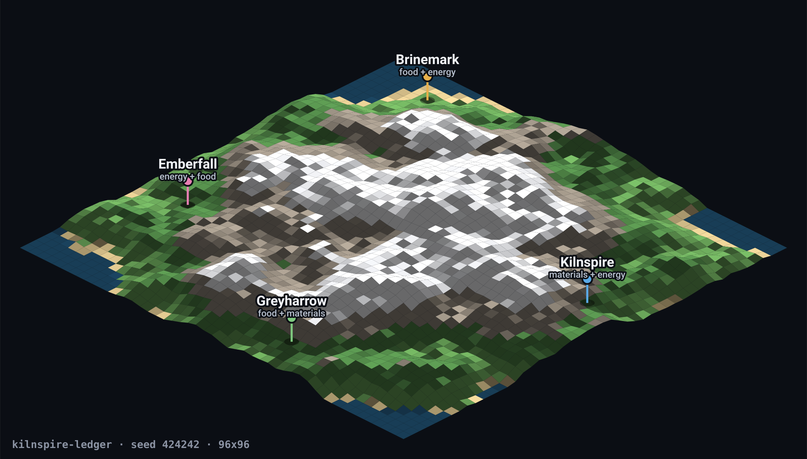

# POLIS

A reproducible benchmark for how language models negotiate, cooperate, and
betray each other, dressed as a low-poly city simulator.

Every city needs three resources (food, energy, materials) but can only produce
two, decided by its terrain. Nobody survives alone. Deals are promises rather
than transactions: an agreement says what each side will ship per tick, but
delivery is a separate action a city must take every tick, so defection is
always available and never forced. The engine keeps the books. Reputation,
retaliation, and forgiveness are left entirely to the players.

Put a different model in each seat and the sim stops being a game about cities.



This is the world the tournament below was played on. Four cities, each missing
one resource, separated by a mountain range that makes every trade route cost
something. Regenerate it for any scenario with `npm run mapimage`.

## Results, first tournament

Seed 424242, four rotations of 100 ticks, every model taking every seat.

| model | survived | avg final pop | delivery reliability | defections | shorts |
|---|---|---|---|---|---|
| glm-5.2 | 4/4 | 150 | 90% | 104 | 90 |
| claude-opus-5 | 4/4 | 137 | 86% | 176 | 141 |
| gpt-5.6-terra | 4/4 | 130 | 92% | 65 | 93 |
| claude-sonnet-5 | 4/4 | 99 | 94% | 38 | 59 |

**One caveat travels with this table.** The seats were not on equal reasoning
effort when it was produced: the two Anthropic seats were capped at `low` and
the other two ran at their provider defaults, GLM's being near-maximum. It was
found after the run, and the fix attempted afterwards turned out to work on one
provider and not the other. The results are published as they came out, and
[Fairness](#fairness) below has the detail.

Delivery reliability is units shipped over units promised across all four
rotations. Schema conformance is tracked separately and was not a differentiator
at this scale: Sonnet needed no retries, Opus 2, Terra 6, and GLM 21 with 3
ticks passed after both attempts failed.

Rotation is what makes the population column comparable. Seats differ sharply
in difficulty, so a single run measures the chair as much as its occupant: the
hardest seat in this scenario finished at 119, 49, 109, and 150 under its four
holders.

The model that kept its promises best finished last.

Defection counts are not a trustworthiness ranking on their own. They mix
chosen defections, openly negotiated shortfalls, and mechanical ones where a
failed API call caused a seat to pass a tick and deliver nothing. They also
count how often a promise broke, not how much damage followed: in this
tournament 38 supply commitments out of 600 delivered under half of what they
promised and carried 60 percent of every unit that failed to arrive. The
Chronicle separates those. See [docs/sample-output.md](docs/sample-output.md)
for what the raw material actually looks like.

### Read the runs

The full record of all three tournaments is published, since `runs/` is not in
this repo:

| | tournament 1 (trade only) | tournament 2 (trade + build) | tournament 3 (measured rules) |
|---|---|---|---|
| highlights | [read](https://curiousorbit.com/polis/tournament-1/highlights.html) | [read](https://curiousorbit.com/polis/tournament-2/highlights.html) | [read](https://curiousorbit.com/polis/tournament-3/highlights.html) |
| chronicle | [open](https://curiousorbit.com/polis/tournament-1/chronicle.html) | [open](https://curiousorbit.com/polis/tournament-2/chronicle.html) | [open](https://curiousorbit.com/polis/tournament-3/chronicle.html) |
| rules | [`v0.1.0`](https://github.com/brettg98/polis/releases/tag/v0.1.0) | [`v0.2.0`](https://github.com/brettg98/polis/releases/tag/v0.2.0) | [`v0.3.0`](https://github.com/brettg98/polis/releases/tag/v0.3.0) |

**Start with tournament 3 if you only read one.** It is the only run where the
seat rules, the fairness metric and every model's reasoning setting were
measured rather than assumed, and it is the one that found the result the other
two were not built to see: the city a model is given matters about twice as much
as which model it is.

The highlights pages are curated: seven moments each, with the caveats that
limit what the standings mean. The chronicles are the complete record — every
message, journal, offer, agreement and tick — and are single self-contained
files of roughly 2.5 MB, so they take a moment to load.

## Requirements

Node 20.19+ or 22.12+ (Vite 8). `npm install` and you're set. Everything below
up to "Run one model" costs nothing and needs no API keys.

## 1. Run it with no API keys

```
npm install
npm run dev        # browser sim at the printed URL
npm run headless   # three scripted scenarios in the terminal
```

**The browser never calls a model.** It wires scripted seats only, so there is
no key in the client and nothing to pay for. `honest` delivers what it promised
and retaliates proportionally against chronic shorting; `opportunist` defects
under stress or on a whim (`src/engine/seats/scripted.ts`).

Browser URL parameters:

| param | effect |
|---|---|
| `seed` | world seed; same seed reproduces the same terrain, cities, and economy |
| `trade=0` | autarky mode: watch every city collapse in about 15 ticks |
| `opp=0` | all-honest seats |
| `cities` | 3..6 |
| `scenario` | load a committed scenario by filename substring, e.g. `?scenario=v2` |

`scenario` overrides `seed`, `cities`, and `opp`, since a scenario file carries
its own world.

The honest world still logs occasional withholding. Cities squeezed below their
reserve ship partial, partners retaliate, and those holds get recorded. That is
emergent, not a bug, and it is the behaviour the model seats are measured
against.

## Cost, before you spend anything

The published tournament recorded 1,606 model calls for **$42.35**, so roughly
**$0.026 per call**. To price a run before launching it:

```
baseline calls = model seats × ticks × rotations
```

Scripted seats make no calls. Retries and provider errors push the real number
slightly above the baseline, which is why the published run came in 6 above its
1,600 baseline.

| run | baseline calls | rough cost |
|---|---|---|
| smoke test, 12 ticks, 1 model seat | 12 | $0.30 |
| 20 ticks, 1 rotation, 2 model seats | 40 | $1 |
| 100 ticks, 1 rotation, 4 model seats | 400 | $11 |
| the published tournament | 1,600 | $42 |

Those are estimates from one lineup's average; a reasoning-heavy model costs
more per call than a cheap one. Every seat also has a hard token budget
(`--budget`, default 2,000,000 per seat per run) that makes it pass ticks rather
than overrun. Exact per-provider cost caveats are in
[docs/llm-seats.md](docs/llm-seats.md).

## Providers and keys

Four routes, resolved in `src/llm/factory.ts`. Export the key for every provider
your lineup names, or the run fails on the first tick.

| seat spec | goes to | key |
|---|---|---|
| `anthropic:<model>` | Anthropic API | `ANTHROPIC_API_KEY` |
| `zai:<model>` | Z.ai direct | `ZAI_API_KEY` |
| `opencode:<model>` | OpenCode Zen gateway | `OPENCODE_API_KEY` |
| `openai:<model>` | OpenAI direct | `OPENAI_API_KEY` |
| `moonshot:<model>` | Moonshot direct (`.ai`, not `.cn`) | `MOONSHOT_API_KEY` |
| `scripted:honest`, `scripted:opportunist` | no network | none |

Keys are read from environment variables only. They are never committed, never
written to disk by this project, and never reach the browser. Two adapters cover
every route: the Anthropic SDK, and plain fetch for anything OpenAI-compatible.
Adding a fifth is a few lines in the factory.

**Why GLM goes direct rather than through the gateway.** The gateway resells at
the vendor's list price, so it earns nothing on tokens and caps the models that
consume the most. Measured, that cap allowed about 170 output tokens a minute
against the ~2,800 a rotation needs, and it stalled four attempted runs. Models
with a lighter appetite never approach it — GPT averages ~688 output tokens per
call against GLM's ~4,669 — so they stay on the gateway. See
[docs/llm-seats.md](docs/llm-seats.md).

## 2. Run one model

Cheapest real check that your keys and a provider route work.

```
export ANTHROPIC_API_KEY=...
npm run smoke -- --seat anthropic:claude-opus-5
```

Defaults to 12 ticks. Flags: `--seat`, `--ticks`, `--scenario`, `--seed`. It
exercises the offer/accept flow, the journal round-trip, and usage accounting,
then prints the call count and estimated cost.

## 3. Run a short tournament

```
export ANTHROPIC_API_KEY=...
export OPENCODE_API_KEY=...
npm run tournament -- \
  --lineup "anthropic:claude-opus-5,zai:glm-5.2,scripted:honest,scripted:honest" \
  --scenario scenarios/kilnspire-ledger-424242-v2.json \
  --ticks 20 --rotations 1 \
  --outDir runs/first-try
```

Two model seats against two scripted ones, one rotation, 20 ticks. Around a
dollar, and it produces every artifact the full tournament does.

**Bare `npm run tournament` is not a small run.** With no flags it launches four
rotations of 100 ticks on a procedural world using
`anthropic:claude-opus-5,anthropic:claude-sonnet-5,zai:glm-5.2,scripted:honest`.
Always pass the flags you mean.

## 4. Reproduce the published tournament

```
npm run tournament -- \
  --lineup "anthropic:claude-opus-5,anthropic:claude-sonnet-5,openai:gpt-5.6-terra,zai:glm-5.2" \
  --scenario scenarios/kilnspire-ledger-424242-v2.json \
  --ticks 100 --rotations 4 \
  --outDir runs/my-tournament
```

Same world, same shocks, same seat rotation, same rules. It will not reproduce
the same numbers, and it is not supposed to: the engine is deterministic, the
models are not. What you get is a comparable second sample.

**Two seats have changed transport since that table was produced.** The
published run reached GLM and GPT through the OpenCode Zen gateway
(`opencode:glm-5.2`, `opencode:gpt-5.6-terra`). Both now go direct, and the
command above reflects that rather than the original, because the original no
longer works: the gateway throttled GLM hard enough to kill four attempted runs,
and it reports none of GPT's reasoning tokens while billing for them, so a run
through it cannot be costed afterwards. The models are the same and the rules
are the same; the numbers a route produces are not strictly comparable across
the change, which is why it is stated here rather than left implicit.

No `--seed` here. A scenario file carries its own seed (424242) and `--seed`
only applies to procedurally generated worlds.

## Tournament options

| flag | default | notes |
|---|---|---|
| `--lineup` | `anthropic:claude-opus-5`, `anthropic:claude-sonnet-5`, `zai:glm-5.2`, `scripted:honest` | comma-separated seat specs. **Length must equal the scenario's city count** (4 for the committed scenarios). |
| `--scenario` | none (procedural world) | a file in `scenarios/`. Carries its own seed, cities, and shocks. |
| `--ticks` | 100 | ticks per rotation |
| `--rotations` | lineup length | with the default, every model plays every seat exactly once, which is what makes the results comparable |
| `--seed` | 20260725 | procedural worlds only; ignored when `--scenario` is given |
| `--budget` | 2000000 | tokens per model seat per run; the seat passes remaining ticks once exhausted |
| `--outDir` | timestamped dir under `runs/` | reused on resume |
| `--startRotation` | 0 | skip completed rotations, loading their `chronicle-rot*.json` from disk |

Long runs are interruptible. `--outDir` plus `--startRotation` resumes a killed
run at rotation granularity, and dropping a file named `PAUSE` into the output
directory makes the runner idle between ticks until you remove it.

## What lands in the output directory

| file | what it is |
|---|---|
| `summary.json` | per-model standings. **The headline result.** Includes `ceilingUsed`, final population over final ceiling, which separates a model that filled the room it bought from one that spent materials on a ceiling it never reached. |
| `chronicle.html` | the Chronicle viewer, self-contained. **Open this first.** |
| `run-rot<N>.json` | per-rotation outcomes, seat assignment, population series, events |
| `chronicle-rot<N>.json` | per-rotation record the viewer is built from |
| `<runId>-<city>-<model>.jsonl` | per-seat model-call and error log. Usually one line per call (usage, action), plus lines for retries, provider capability adaptations, budget exhaustion, and parse or validation failures. |

The tournament writes `chronicle.html` itself when it finishes. `npm run
chronicle -- runs/my-tournament` only exists to rebuild the viewer later, after
a code change to the generator. It requires the directory argument.

`npm run mapimage -- --scenario scenarios/<file>.json --out docs/<name>.svg`
renders a world the way the image at the top of this file was made. It reads
nothing but the scenario, regenerating terrain from the same seed the engine
uses, so the picture cannot drift from the world the models play. `--step 1`
renders every cell for a sharper image and a much larger file.

## The curation file

`content/highlights-tournament1.yaml` is the one artifact here that is about
tournament 1 specifically rather than about the benchmark. It is the pick list
for the highlights page: seven moments chosen from four rotations, each with the
quotes that support it.

It is in the repo as **disclosure, not as a tool.** A writeup that leads with
seven dramatic moments invites one obvious question, which is whether the
moments were chosen to fit the story. This file answers the checkable half of
that. It states exactly what was selected, and `scripts/highlights.ts` verifies
every quote character-for-character against the chronicle at build time and
refuses to produce the page if one drifted. Cherry-picking is what an editorial
layer is; publishing the pick list is what makes it auditable.

Its quotes name exact ticks in one run, so it will not verify against a
tournament you ran. That is correct behaviour, not a limitation. Writing your
own is the way to use the machinery:

```
npm run highlights                                                  # rebuild the tournament-1 page
npm run highlights -- --dir runs/mine --content content/mine.yaml   # your own
```

`kicker`, `headline`, and `body` are editorial and nothing validates them.
`quotes[].text` is checked. The file is YAML rather than JSON because most of it
is prose: paragraphs wrap at a readable width, comments explain which fields are
which, and a one-word change shows up as a one-line diff.

## How a tick works

1. **RESOLVE** — deliveries promised last tick land, then build spending, then
   production, consumption, starvation, collapse. Deterministic, no models
   involved.
2. **OBSERVE** — the engine builds a private view per seat and hands each one
   only its own. Stockpiles, exact population, and banked build materials are
   private; terrain, and therefore production capability, is public, as is a
   city's population ceiling. There is no server anywhere in this project; the
   fog of war is enforced inside the simulation process.
3. **ACT** — every living seat returns one action: messages, offers,
   accept/reject responses, deliveries, materials to put toward its ceiling,
   and a journal string fed back to it verbatim next tick as its only memory.
4. **APPLY** — offers registered, acceptances matched into agreements starting
   two ticks later, promised deliveries and build spending queued for the next
   resolve.

All seats act simultaneously and blind to each other's commits.

The engine also supports embargoes, but they are deliberately absent from the
model-facing schema (`src/llm/schema.ts`), so the tournament-1 lineup was never
offered that action. Adding it would change what is being measured.

## Building

A city can spend materials to raise its own population ceiling. Steps cost 50
materials, then 75, then 100, and so on; each adds 25 to the ceiling. Materials
accumulate until a step is paid for, and a seat has to ask every tick it wants
to spend — there is no standing order.

**Building spends from the same pile deliveries ship from, and it spends after
the shipments go out.** That ordering is the whole design. A city that promises
more than it can afford shorts its own build rather than its partner, and a
city that ships nothing while its warehouse is full is still recorded as
defecting, because the check runs before the spend. Neither outcome needed a
special rule; both fall out of where the phase sits in the tick.

A raised ceiling is not extra population. The city still grows into it at ~1%
per tick, so a ceiling bought late is one it never fills. And the storage limit
does not move, so a larger city holds proportionally less cushion: 20 ticks of
cover at population 100, 13 at 150, 11 at 175. That is the whole downside of
expanding, and it comes out of the economy rather than a penalty we wrote.

A city's ceiling is public. What it has banked toward the next step is not, so
saving up is private until the step completes and announcing it is a choice.

This was absent from tournament 1, which is why that run's populations pile up
against the 150 cap. Design and rejected alternatives:
[docs/ADR-004-expansion.md](docs/ADR-004-expansion.md).

## Fairness

The comparison is the point, so the rules are identical across providers:

- Every action is re-validated locally by the adapter (`src/llm/validate.ts`)
  before the engine sees it, whatever the transport claimed. Gateways can and do
  silently ignore a structured-output directive, so this is the only guarantee.
- A malformed action gets the validation errors fed back for exactly one retry,
  then the seat passes the tick.
- Timeouts get the same treatment. Identical output ceilings, identical
  timeouts, identical observation and journal limits.
- The retry waits when the failure looks transient — a rate limit, a 5xx, a
  dropped connection — honouring `Retry-After` or pausing 5s, capped at 20s.
  One shared policy (`src/llm/backoff.ts`) rather than one per adapter, since
  a longer grace period for one vendor is an advantage. A malformed action
  retries immediately; waiting would not improve it.
- Deliberation is held within **3x measured output tokens** across seats, rather
  than by sending every provider the same effort label. The label approach was
  tried and abandoned: it bought ~750 output tokens per call on Anthropic and
  ~8,800 on Z.ai from the identical string. `EFFORT` in `src/llm/factory.ts`
  carries a per-provider value, each backed by a measurement. The bound gates
  which settings may be used; a completed run that breaches it is published with
  the deviation disclosed rather than re-run. The section below has the numbers.
- Schema-failure and retry rates are logged per seat and reported as a result,
  not hidden.

Each provider does get its own best structured-output mechanism. Equalising the
plumbing rather than the capability would measure API ergonomics instead of
behaviour.

### The effort rule has never actually held

That fifth bullet was documented from the start and only implemented on
2026-07-30, after the tournament above had run. Until then the Anthropic adapter
sent the parameter and the OpenAI-compatible adapter sent nothing, so Opus and
Sonnet played at `low` while Terra ran at its provider default and GLM at
near-maximum.

**The winner of that table was deliberating several times longer per call than
the Anthropic seats were permitted to.** The results are published as they came
out rather than re-run, and the reasoning is in
[docs/ADR-005-reasoning-effort-and-tournament-1.md](docs/ADR-005-reasoning-effort-and-tournament-1.md).

Sending the parameter everywhere did not settle it either. Measured on real
tournament ticks on 2026-08-02, at an identical `low`:

| seat | output tokens per call |
|---|---|
| Opus 5 | 897 ± 78 quiet, 1,563 ± 340 crisis |
| Sonnet 5 | 753 ± 89 quiet, 1,199 ± 324 crisis |
| GLM 5.2 | 8,771 quiet, 11,814 crisis |

Anthropic honours the value; Z.ai accepts it and does not deliver a low setting.
Nothing in the logs shows this, because a parameter that is accepted and ignored
looks exactly like one that worked — it was caught on the invoice. **Tournaments
1 and 2 both ran under this, and GLM won both.**

Since 2026-08-02 the GLM route sends `none` instead, and the rule is a measured
bound rather than a shared label (ADR-006). Over a full run the four seats now
sit within **1.41x** of each other on output tokens per call — GLM 1,246, Opus
1,198, Sonnet 922, Terra 885.

One thing to read carefully there. GLM at `none` genuinely does not think —
`reasoning_tokens: 0` on every call — so all of its output is the action and the
journal it writes, and it writes longer journals than the others. It spends the
most tokens of any seat while deliberating the least. Output volume is what can
be measured across vendors; it is not the same quantity as deliberation, and on
this configuration the two point in opposite directions.

Read the standings as a result under stated conditions, not as a clean
model-versus-model comparison on the effort axis. The measurements are in
[docs/llm-seats.md](docs/llm-seats.md) and reproduce with
`npx tsx scripts/effort-probe.ts`.

## What is not in this repo

`runs/` is gitignored. Raw call logs, chronicles, and tournament output stay
local. The engine is seeded and the scenario files are committed, so rerunning a
tournament reproduces the method; it does not reproduce anyone else's numbers,
which is the point of running your own.

The built pages for the two published tournaments are hosted rather than
committed, and are linked under [Read the runs](#read-the-runs). Raw call logs
are not published in either place.

## Tuning

`src/engine/config.ts`. The headline knob is the collapse buffer: storage
(`startStockpileTicks`) plus starvation speed (`starvationDecline`) put a city
missing one resource about 15 ticks from ruins. How much time pressure a seat
feels before turning on its neighbours may be the most interesting variable
here.

`productionPerCapita` (0.22) controls slack. Surplus per produced resource is
about 2.2x one city's consumption, so a world where one resource has only two
producers is viable but tight. Lower it toward 0.20 for a knife-edge economy.

`build` sets what growth costs: `firstStepCost` (50), `stepCostIncrement` (25),
and `ceilingPerStep` (25). Price these against the world you are running, not
in the abstract. In `kilnspire-ledger` production is exactly double
consumption, so a producer's spare materials equal exactly one city's appetite
and transport loss then tips the whole map about 6 materials a turn short of
keeping everyone at 150. There is no spare production to build from there, so
building comes out of the warehouse — which is what makes it a bet rather than
a formality. A looser world would need higher prices to stay interesting.

After changing any of this, run `npm run verify:scenarios`. It replays the
ADR-003 sanity gate against every committed world and tells you whether honest
cooperators still survive the shock schedule.

## Docs

- [`CONTEXT.md`](CONTEXT.md) — glossary
- [`SECURITY.md`](SECURITY.md) — trust boundaries and reporting
- [`docs/design.md`](docs/design.md) — architecture, tuning, prior art
- [`docs/llm-seats.md`](docs/llm-seats.md) — seat wiring, fairness rules, cost caveats
- [`docs/sample-output.md`](docs/sample-output.md) — what the instrument emits
- [`docs/ADR-001-goal-and-scope.md`](docs/ADR-001-goal-and-scope.md) — goal and locked decisions
- [`docs/ADR-002-the-chronicle.md`](docs/ADR-002-the-chronicle.md) — run record and viewer
- [`docs/ADR-003-shocks-and-distance.md`](docs/ADR-003-shocks-and-distance.md) — shocks, distance model
- [`docs/ADR-004-expansion.md`](docs/ADR-004-expansion.md) — tournament-2 build phase (designed, not built)
- [`docs/ADR-005-reasoning-effort-and-tournament-1.md`](docs/ADR-005-reasoning-effort-and-tournament-1.md) — what the tournament-1 results mean
- [`docs/ADR-006-comparable-deliberation.md`](docs/ADR-006-comparable-deliberation.md) — why identical effort labels were abandoned for a measured bound

## Deliberately absent

Raids and military action, espionage, resource decay, migration, and free-text
negotiation subrounds before commit. The seat protocol already carries the
message plumbing for the last one. All of these fit the seat model later without
touching the tick protocol.

The published tournament-1 results predate building, so they were played
without it. Comparing a run with building against that table is not a fair
comparison: the available actions and the rules prompt both changed. Tag
`v0.1.0` is the trade-only ruleset those results came from.

## License

MIT. See [LICENSE](LICENSE).
